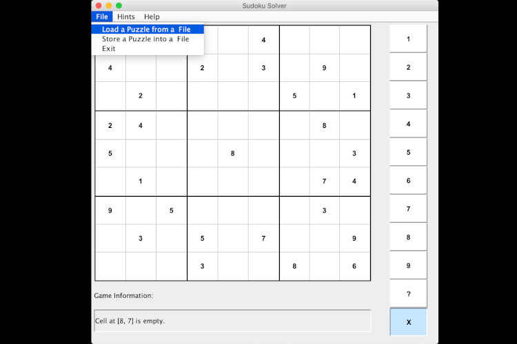
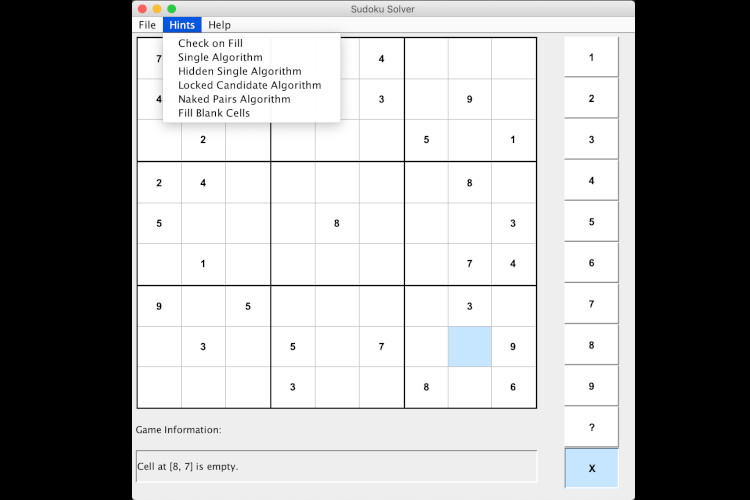
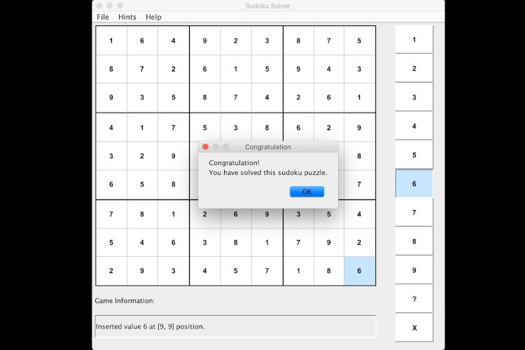
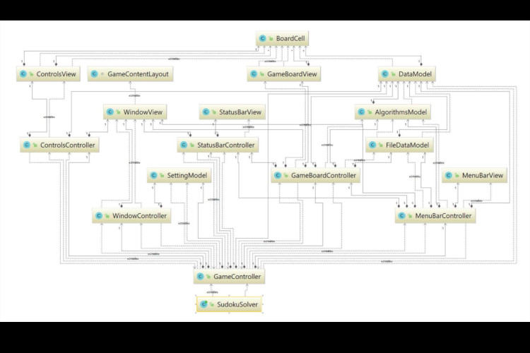

# sudoku-solver
Sudoku Solver

Sudoku Solver is a GUI (Graphical User Interface) game that implements popular puzzle where player has to solve 9x9 grid. Additionally, this grid is divided into 9 smaller boxes. Game uses numbers 1 through 9, and each of these numbers can appear only once in a small box, and only once in the row or column in 9x9 grid. Player can load a board from the file and save current state to the file. Program has some algorithms that can be used to help solving the game using hints or even solve the entire board. Other features implemented in this project display to the user a list of the candidates that can fit in the empty field and display numbers which can be used in that particular field. By default, this option is turned off. However, this feature can be turned on/off any time during the game by choosing and marking this option in the hints menu.

